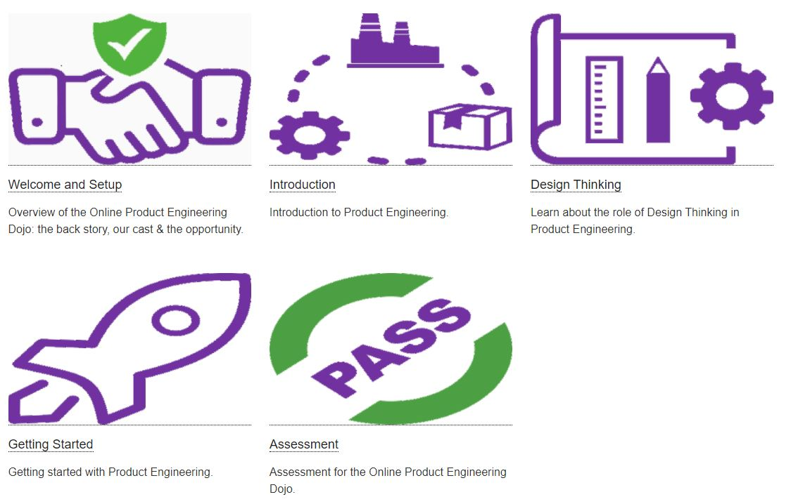

## Product Engineering Dojos

DevOps Dojos became popular since Target, an important U.S.-based retail company, started to introduce such a practice back in 2014 in support of its DevOps transformation.
Since then, multiple conference talks, white papers and — more recently — books have been published about DevOps Dojos.

Since then, DXC ran DevOps Dojos for own employees and customers, but we quickly came to a point where our physical DevOps Dojos were not enough to cover all the needs. Everyone was loving the experience, and to this day the on-site experience still leads to great results. But we had a scale issue: we just could not accommodate everyone we needed to address so we developed an interactive browser based DevOps Dojo for our staff. Following the success of that effort, and as a means of giving something back to the community from which we have learnt so much we released an open source version of our DevOps Dojo - the [Online DevOps Dojo](https://dxc-technology.github.io/about-devops-dojo).

In parallel we continued to apply the Dojo model to other problem domains including Product Engineering, a version of which we are know open sourcing.

Let us introduce "**Online Product Engineering Dojo**".
## Extending with Online Product Engineering Dojo

While continuing physical and face-to-face Dojos on a range of subjects, to scale and better reach our over 100,000 employees we needed to expand our internal dojo offerings with an online add-on which we could use to:

* Prepare for a face-to-face or virtual Product Engineering Dojo or Design Thinking Workshop by learning techniques in advance.
* Create a complete curriculum with interactive modules.
* Provide a browser based way to get knowledge when students most need it.
* Share what "good looks like" when answering enquiries in relation to Product Engineering Dojo or Design Thinking patterns
* Continue to leverage [the story](#a-story) and the characters, and even extend the story to create more learning experiences — following on from the [Online DevOps Dojo](https://dxc-technology.github.io/about-devops-dojo)

We could easily have written slides or recorded videos from our coaches instead we we started creating an immersive online learning experience: the "Online Product Engineering Dojo."

Online learning experiences are now an essential part of a "new normal." They are a new way of acquiring knowledge and sharing it with others. Social distancing has accelerated that movement.

## A Story

Our challenge was to make the experience immersive. There is nothing better than a good story to engage people so, we created one to support the training.

The modules tell the story of a fictitious company, "Pet Clinic," and its employees as they go through their Product Engineering journey.

Let us introduce you to some of the team members:

|  |  |
| - | - |
|  | **C**harlie is the **C**EO of the Universal Imports Group and a technology entrepreneur, investor, and philanthropist. He views the discipline of Product Engineering as being essential to tilting the scales in favour of future successes rather than in favour of future failures. |
|  | **B**renda from the **B**usiness, is keen to understand how Product Engineering principles can be applied to help ensure the right product are developed for the intended users in the most efficient manner possible |
|  | **M**iyagi Product Engineering **C**oach and **M**entor hired by **C**harlie to increase the use of Product Engineering within the United Imports Group |
|  | **A**driana is an **A**rchitect working on the R237 control software for Redrum, InGen's revolutionary rocket designed for suborbital flights. **A**driana has an interest in all phases of the Product Engineering life cycle but has a particular interest in architecture for testability |
|  | **P**ennyworth a **P**roject Manager from the Daily Mentioner national newspaper is a servant leader, he facilitates the work of the teams on the projects he manages. A loyal and longstanding confidant of **C**harlie, **P**ennyworth often acts as **C**harlie's weather wayne, pardon the pun, on new programs like the introduction of Product Engineering to the Universal Imports Group. |

Throughout the modules, you get to learn about everyone (including more characters), interact with them, and understand how each one plays a role in the adoption of Product Engineering in the Universal Imports Group. transformation of the Pet Clinic company.

## Learning modules

At launch, we released 5 modules:

* Welcome
* Introduction
* Design Thinking
* Getting Started
* Assessment

Those modules are a mix of both cultural and practice topics.

The modules provide a very interactive experience in which you can follow the step-by-step instructions as well as go off script to explore and learn more, without fear of breaking anything.

## Open Source

The Online Product Engineering Dojo learning modules are released under the [Mozilla Public License 2.0](https://github.com/dxc-technology/online-pe-dojo/blob/master/LICENSE).

We are making the Online Product Engineering Dojo available to benefit the entire development community. We hope the modules will be useful. Our primary goal is to contribute a set of DevOps learning experiences so the community can assemble and create more content in support of DevOps adoption. (It is not about offering training as a service.)

## What's next?

Shall we play a game?

First, we would like to welcome everyone trying out the learning modules. We sincerely hope they will help in supporting the adoption Product Engineering in your organization.

Second, we plan to release new modules, depending on the reception of the initial launch.

Beyond the initial launch, we are eager to build a community around the Online Product Engineering Dojo — a community of module maintainers, translators, story tellers and even creators of new learning modules.

Let’s support the adoption of Product Engineering!
